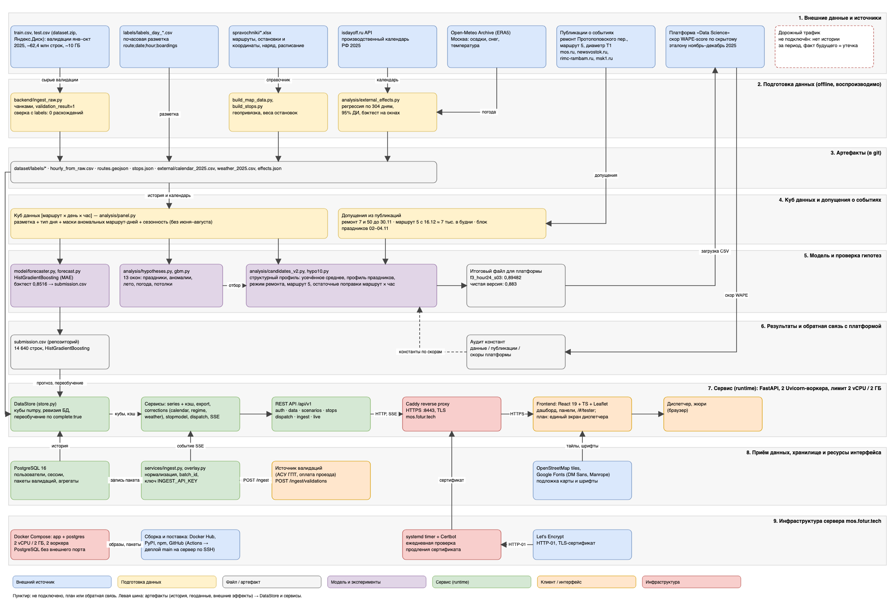

# МОС.ТРАМ — прогноз пассажиропотока трамваев Москвы

Проект для хакатона Московского транспорта (трек «ИИ-прогноз загрузки трамвайных маршрутов»). Сервис прогнозирует почасовые посадки по маршруту, дате и часу на период с 1 ноября по 31 декабря 2025 года (10 маршрутов × 61 день × 24 часа = 14 640 строк). Диспетчер видит, в какие часы и на каких участках ждать пик, когда поток превысит пропускную способность линии (по параметрам, которые он задаёт сам) и в какие дни спрос ниже обычного.

Стек: Python 3.12 и FastAPI (API и ML), React 19, TypeScript 5 и Leaflet (интерфейс), PostgreSQL, Docker Compose. Backend написан на Python, а не на рекомендованных в ТЗ Java и Spring: модель обучается и работает на Python (scikit-learn), поэтому API и ML-контур делят один язык и один процесс, без передачи модели между JVM и Python. Остальные рекомендации ТЗ (React 19+, TypeScript 5+, Leaflet, PostgreSQL, Docker Compose, один контейнер 2 vCPU / 2 ГБ) выполнены.

## Материалы для жюри

| Что требуется | Где найти |
|---|---|
| 1. Артефакты ML-модели, код обучения и инференса, README с инструкцией запуска | [`model/`](model/) (обучение и инференс), [`analysis/`](analysis/) (бэктесты и гипотезы), [`submission.csv`](submission.csv), разделы «Быстрый старт» и «Модель и качество» |
| 2. Все внешние данные, использованные в решении | [docs/external-sources.md](docs/external-sources.md) (реестр источников со ссылками), [docs/external-integrations.md](docs/external-integrations.md) (список интеграций), раздел «Внешние данные и интеграции» |
| 3. Запускаемый веб-сервис (Docker Compose), точки входа API, инструкция для жюри | Раздел «Быстрый старт»; развёрнутый сервис `https://mos.fotur.tech:8443/` (логин и пароль переданы в форме сдачи), API `/api/v1/...`, документация `/docs` |
| 4. Схема архитектуры и модулей, область определения и адаптации модели, зависимости от внешних данных | [docs/architecture.png](docs/architecture.png) и [docs/architecture.drawio](docs/architecture.drawio), разделы «Архитектура» и «Область применимости модели» |
| 5. Сведения о производительности и дополнительные возможности | Разделы «Производительность» и «Дополнительные возможности» |
| 6. Ограничения и план развития | Разделы «Ограничения» и «План развития» |

## Быстрый старт

```bash
python3 -m backend.setup_env     # спросит логин и пароль (не короче 12 символов) и создаст .env; на Windows: python
docker compose up --build        # http://localhost:8000 (другой порт: TRAM_PORT=8010 docker compose up)
```

`setup_env` использует только стандартную библиотеку Python. Если Python на машине нет, `.env` можно создать через Docker: `docker run --rm -it -v "$PWD":/app -w /app python:3.12-slim python -m backend.setup_env`.

Регистрации в сервисе нет: вход по логину и паролю, которые заданы в `.env`. `.env` нельзя добавлять в Git.

| Что | Адрес |
|---|---|
| Дашборд: карта, графики, экспорт, горизонты «день / месяц / год», коэффициенты, остановки и участки | `http://localhost:8000` |
| Проверка каждого эндпоинта вручную, включая негативные сценарии | `http://localhost:8000/#/tester` |
| Документация REST API (OpenAPI) | `http://localhost:8000/docs` |
| API | `http://localhost:8000/api/v1/...` |

Compose поднимает два контейнера: приложение (лимит 2 vCPU и 2 ГБ, два Uvicorn-воркера) и PostgreSQL, порт которого наружу не открыт. В базе лежат пользователи, сессии, принятые пакеты валидаций и их почасовые агрегаты. Исторические разметки и геосправочники входят в образ, сырые `train.csv` и `test.csv` (около 10 ГБ) — нет.

Доступ ограничен: без входа открыты только экран входа, проверка состояния (`/api/health`, `/api/v1/health`) и документация (`/docs`, `/openapi.json`), остальное требует HTTP-only сессии с `SameSite=Strict`. Приём валидаций можно дополнительно закрыть ключом `INGEST_API_KEY` (по умолчанию он не задан, для публичного сервера его нужно задать).

### Сервер

`docker-compose.server.yml` запускает приложение и PostgreSQL отдельным Compose-проектом. База и API живут во внутренней сети, прокси подключён к собственной сети, порты на хост не публикуются.

1. Клонировать репозиторий в `/opt/hackathon-transport-moskvy`.
2. Выполнить `python3 -m backend.setup_env --server`: мастер спросит логин и пароль и создаст `.env` с правами `0600`.
3. Запустить `docker compose -p moskvy-tram -f docker-compose.server.yml up -d --build`.
4. Для продления сертификата скопировать `deploy/systemd/moskvy-tram-cert-renew.service` и `.timer` в `/etc/systemd/system/` и выполнить `systemctl daemon-reload && systemctl enable --now moskvy-tram-cert-renew.timer`.

Публичный вход работает на `https://mos.fotur.tech:8443/`, порт `8443/tcp` должен быть открыт в firewall. Сертификат выпускает Certbot (HTTP-01, порт 80). Таймер раз в сутки проверяет срок и продлевает сертификат при остатке 30 дней и меньше: порт 80 освобождается на время продления, затем Caddy возвращается на 80 и 443. Чтобы сменить пароль, остановите стек, удалите `.env`, запустите мастер заново и пересоздайте контейнер приложения; старые сессии перестанут действовать.

### Локальная разработка

```bash
python3 -m venv .venv && source .venv/bin/activate      # Windows: .\.venv\Scripts\Activate.ps1
python -m pip install -r backend/requirements-dev.txt
(cd frontend && npm install && npm run build)             # Node 20+
python backend/build_map_data.py && python -m backend.build_stops
python -m uvicorn backend.main:app --host 127.0.0.1 --port 8000
```

Фронтенд с hot reload: `cd frontend && npm run dev` (порт 5173, адрес бэкенда для прокси задаётся `VITE_API_TARGET`). Для доступа из сети используйте `--host 0.0.0.0` только вместе с `INGEST_API_KEY` и настроенным прокси или firewall. Тесты: `python -m pytest`.

## Архитектура



Полная схема со всеми зависимостями от внешних данных: [docs/architecture.png](docs/architecture.png), исходник для draw.io: [docs/architecture.drawio](docs/architecture.drawio). Ниже та же логика в текстовом виде.

```
 dataset/train.csv, test.csv ─► backend/ingest_raw.py ─► почасовые посадки (сверка с labels/*)
 dataset/labels/*.csv ───────────────────────────────┐
 dataset/spravochniki/*.xlsx ─► build_map_data.py ─► artifacts/routes.geojson ┐
                              └► build_stops.py  ─► artifacts/stops.json      │
 isdayoff.ru, Open-Meteo ─► analysis/external_effects.py ─► artifacts/external/ (календарь, погода, эффекты)
                                                                               ▼
 POST /ingest/validations ─► PostgreSQL ─► DataStore (numpy-кубы маршрут × день × час)
                                              │
 model/forecaster.py (обучаемая модель) ──────┤ прогноз и переобучение по завершённым дням
 analysis/* (профиль, события, поправки) ─────┘ кандидаты для платформы, бэктесты
                                              │
 FastAPI: routers ─► services ─► DataStore + кэш ответов ─► React + TypeScript + Leaflet (тот же порт)
```

Цепочка модулей: приём и нормализация данных → признаки и геопривязка → ML-прогноз и агрегация → REST API → frontend.

| Модуль | Роль |
|---|---|
| `backend/ingest_raw.py`, `services/ingest.py`, `overlay.py` | Нормализация валидаций и запись в БД, идемпотентность по `batch_id` |
| `backend/build_map_data.py`, `build_stops.py` | Справочник xlsx → GeoJSON маршрутов и остановки с координатами |
| `model/forecaster.py`, `model/forecast.py` | Обучаемая модель `HistGradientBoostingRegressor`, скользящий бэктест, сборка `submission.csv` |
| `backend/app/store.py` | Numpy-кубы данных; после завершённого дня переобучает модель и пересчитывает прогноз |
| `services/series.py`, `export.py` | Единая выборка и валидация для API и экспорта, кэш ответов, CSV и XLSX |
| `services/scenarios.py`, `corrections.py`, `regime.py`, `external.py` | Коэффициенты, поправки `calendar`, `regime`, `weather`, годовой горизонт |
| `services/stopmodel.py`, `stops.py` | Оценка потока по остановкам и участкам |
| `services/dispatch.py` | Сводка диспетчера: пики, горячие участки, расчёт потребности в трамваях, дни для пересмотра выпуска |
| `services/live.py` | Поток обновлений `GET /stream` (Server-Sent Events) |
| `analysis/*` | Бэктесты, гипотезы, сборка файлов для платформы |
| `frontend/` | Дашборд `src/App.tsx`, панели `src/panels/`, страница проверки `src/Tester.tsx` |

Хранилище передаётся явно (`app.state.store`), глобального состояния нет. Ошибки всегда приходят как `{detail, code}` на русском. Поправки применяются слоем поверх прогноза и не меняют модель. Несколько воркеров видят одну запись через ревизию БД.

Принятый пакет сразу обновляет историю и SSE-поток. Пакет с `complete: true` подтверждает полноту указанных дат: остальные часы этих дат считаются нулевыми, модель переобучается, прогноз пересчитывается после последнего завершённого дня. Неполные дни в обучение не попадают, их посадки видны в `ml_model.pending_boardings`. Это пакетное переобучение, потому что у `HistGradientBoostingRegressor` нет `partial_fit`.

## Данные и пайплайн приёма

`python -m backend.ingest_raw` читает `train.csv` и `test.csv` кусками, оставляет успешные валидации (`validation_result == 1`), берёт маршрут из `ngpt_route`, час из `tran_date_time` (`input_date_time` ненадёжен) и агрегирует до маршрут × дата × час. Итог сверен с разметкой организаторов: 62,4 млн строк превращаются в 57 563 почасовые строки, расхождений нет. 562 посадки 1 ноября 2025 года остались за пределами разметки как хвост суток. Тот же код нормализации работает в `POST /ingest/validations`, поэтому пайплайн можно повторить на новых данных.

В истории 10 месяцев (01.01–31.10.2025) и 9 маршрутов: у маршрута 5 наблюдений нет.

Остановки привязаны по справочнику с координатами (маршруты 1, 5, 7, 11, 12). В валидациях остановки нет (`place_id` — депо), поэтому поток маршрута делится между остановками по весам: начальная остановка направления ×2, конечная ×0,15, узловая ×1,5, направления поровну. Загрузка участка считается моделью длины поездки (в среднем 8 остановок). **Это оценка, а не измерение**: ответы помечены `estimated: true`, а веса в `backend/app/config.py` не калибровались, проверить их нечем.

Так и задумано организаторами: в описании датасета остановочная детализация названа необязательным бонусом, основная метрика считается по маршрут × час, а разъяснения организаторов от 26.09.2026 подтверждают, что привязка валидаций к остановкам необязательна и главное — общий пассажиропоток. Поля `place_id` (площадка или депо), `bus_exit_no` (номер выхода или графика) и `garage_number` (борт) остановку посадки не содержат, поэтому сопоставить валидацию с остановкой по данным нельзя.

## Модель и качество

**Что лежит в репозитории.** `submission.csv` (`route;date;hour;prediction`, разделитель `;`, 14 640 строк) собран моделью `HistGradientBoostingRegressor` по ячейкам маршрут × дата × час. Признаки: маршрут, день недели, час, месяц, тип дня по календарю РФ, годовая сезонность и профиль маршрут × день недели × час. Скользящий бэктест без перемешивания дат дал 0,8561 на мае–июне, 0,8391 на июле–августе и 0,8596 на сентябре–октябре, в среднем 0,8516. Повтор: `python model/forecast.py --rolling-backtest`.

Обученная модель отдельным файлом не хранится: сервис обучает её при старте на истории (от 3 до 12 секунд при лимите 2 vCPU), а состояние обучения показывает `GET /api/health` в поле `ml_model`. Прогноз, который сервис строит при старте, отличается от `submission.csv` на доли процента (сумма прогноза около 11,85 против 11,81 млн посадок): обучение не детерминировано, поэтому цифры между запусками слегка меняются. На платформу загружается именно файл.

**Как строится итоговый прогноз для платформы.** Контур `analysis/` даёт лучший скор платформы 0,89482. Чистая версия, где все константы взяты только из данных и публикаций, — 0,883. Основа — профиль маршрут × день недели × час: усечённое среднее (10 %), только школьный сезон (июнь–август исключены), без праздничных будней и аномальных маршрут-дней (ремонты, закрытия). Отдельно считается профиль праздничных будней (в истории их 12). Дальше добавляются:

1. режим ремонта маршрутов 7 и 50 в ноябре (коэффициенты берутся по данным) и возврат к обычному режиму в декабре;
2. запуск маршрута 5 с 16 декабря на уровне около 7 тысяч посадок в будни;
3. календарные особенности: рабочая суббота 1 ноября, воскресенье 2 ноября внутри праздничного блока, праздники 3–4 ноября и 31 декабря;
4. свежие уровни маршрутов осени, форма часов будней и остаточные поправки маршрут × час (24 блока, не более ±15 %).

Воспроизведение: `python -m analysis.candidates_v2 --best5`, затем `python -m analysis.hypo10 --roundc 0.3,0,0,0.7 --blocks 24 --clip 0.15`.

**Проверка гипотез.** `python -m analysis.hypotheses` прогоняет 13 скользящих окон «обучение до даты, прогноз на 61 день». Основные результаты (средний score по окнам):

| Гипотеза | Среднее | Вывод |
|---|---:|---|
| Базовый профиль | 0,7998 | Основа сравнения |
| Отдельный профиль праздничных будней | 0,8330 | Главный выигрыш, +1,6 п.п. (на майском окне до +4,8) |
| Без аномальных маршрут-дней | 0,8320 | +0,1 п.п. |
| Без летних каникул | 0,8267 | На окне сентябрь–октябрь +0,9 п.п. |
| Автоматические сдвиги режима по свежим неделям | 0,8230–0,8264 | Вредят: сдвиги в основном временные |
| Фактическая погода | 0,8267–0,8382 | В пределах шума окон |
| Градиентный бустинг | 0,8502 | Не лучше профиля в школьный сезон |
| Уровень последних 28–84 дней | 0,8188–0,8293 | Не улучшает |

**Путь скора на платформе.** Файлы загружались раундами, лучший результат после каждого:

| Раунд | Что проверяли | Лучший скор |
|---|---|---:|
| f | ремонт 7 и 50, уровень маршрута 5, смесь с бустингом, общий уровень | 0,88561 |
| h, k | поправки по итогам f, форма дня | 0,88873 |
| m, b | праздники, блок выходных, расщепление по маршрутам | 0,89094 |
| t | свежие уровни, форма часов, праздничные дни | 0,89232 |
| c, d, e | сочетание лучших гипотез, остаточные поправки маршрут × час | 0,89401 |
| финал | усиление по часам (24 блока) | **0,89482** |

**Потолок.** На окне сентябрь–октябрь профиль с точными средними самого окна даёт 0,9253, с известными суточными суммами маршрутов — 0,9403, чисто пуассоновский шум — 0,9791. Значит 0,92–0,95 достижимо только модели, знающей ответ заранее. Реалистичный потолок на скрытых ноябре–декабре около 0,89–0,91. Оставшаяся ошибка — непредсказуемые колебания маршрут-дня: 46 % приходится на недельный уровень маршрута, а автокорреляция затухает за две недели.

**Что подобрано по данным, а что по скорам платформы.** По данным и публикациям: профиль, усечение, профиль праздников, маски аномалий, коэффициенты режима ремонта, календарные события. По скорам платформы (сравнение файлов целиком, а не отдельных ячеек): доля возврата ремонта в декабре (0,87), уровень маршрута 5, общий уровень ноября и декабря, множители 1 ноября, поздних декабрьских дней и выходных. Такие константы оценены по разности скоров и могут не перенестись на другие данные, поэтому чистая версия приведена отдельно. Значения скрытых ячеек мы не извлекали и не подстраивались под отдельные ячейки.

Замена `submission.csv` итоговым файлом остаётся решением ML-участника.

## Внешние данные и интеграции

Календарь и погода загружаются заранее скриптом `python -m analysis.external_effects`, кэшируются в `artifacts/external/` и оттуда читаются сервисом. **Сервис в рантайме не делает исходящих запросов к внешним API.**

Кратко о том, что от чего зависит и что будет при сбое:

| Интеграция | Когда нужна | Без неё |
|---|---|---|
| isdayoff.ru (календарь) | Только при пересчёте эффектов (`--refresh`) | Сервис работает по кэшу `calendar_2025.csv` из репозитория; если файла нет, календарные поправки отключаются, остальное работает |
| Open-Meteo (погода) | Только при пересчёте эффектов | Сервис работает по кэшу `weather_2025.csv`; без него не применяется только поправка `weather` |
| Публикации о событиях | Только при разработке | Не нужна: события зашиты в допущения `analysis/candidates_v2.py` |
| Датасет организаторов, платформа хакатона | Только при разработке | Не нужны сервису |
| Тайлы OpenStreetMap | При каждом открытии карты в браузере | Подложка пустая, маршруты и остановки на карте остаются |
| Google Fonts | При каждом открытии интерфейса | Используются системные шрифты |
| Let's Encrypt и Certbot | Раз в ~60 дней (продление) | Сертификат истекает, HTTPS перестаёт работать; сервис по HTTP внутри сети продолжает работать |
| Docker Hub, PyPI, npm | Только при сборке образа | Уже собранный образ работает без них |
| GitHub Actions | При каждом пуше в `main` | Автоматический деплой не срабатывает, сервис продолжает работать на предыдущей версии |

### Источники данных

| Источник | Ссылка | Что берём | Эффект на посадках (январь–октябрь 2025, 95 % ДИ) | Как используем |
|---|---|---|---|---|
| Производственный календарь РФ, isdayoff.ru | <https://isdayoff.ru/>, запрос `https://isdayoff.ru/api/getdata?year=2025&pre=1&cc=ru` | Праздники, переносы, сокращённые дни | Праздничный будний день −53,5 % [−55,8; −51,1], 12 дней | Тип дня в признаках модели и отдельный профиль праздников; `GET /calendar`, `/factors` |
| Погода, Open-Meteo Historical Weather API (ERA5) | <https://open-meteo.com/en/docs/historical-weather-api>, запрос `https://archive-api.open-meteo.com/v1/archive?latitude=55.75&longitude=37.62&start_date=2025-01-01&end_date=2025-12-31` | Осадки, снег, температура по суткам (Москва) | Осадки ≥ 5 мм −6,5 % [−9,2; −3,7]; снегопад ≥ 2 см −6,7 % [−12,0; −1,2]; мороз и жара не значимы | Поправка `weather`, `GET /weather`, пресеты коэффициентов (только сценарии) |
| Ремонт путей в Протопоповском переулке | <https://newsvostok.ru/dlya-tramvaev-7-i-50-izmeneniya-po-vyhodnym-budut-dejstvovat-do-kontsa-oseni/>, <https://rimc-rambam.ru/news/14880/> | Трамвай 50 не ходит по выходным, 7 ходит короче, срок «до конца осени» | В истории маршрут 50 по выходным на уровне 0,06 обычного, маршрут 7 около 0,58–0,69 | Режим ремонта в ноябре, возврат в декабре |
| Запуск трамвая 5 (Рижская — Белорусский вокзал), 16.12.2025 | <https://www.mos.ru/mayor/themes/13888050/>, <https://msk1.ru/text/transport/2025/12/16/76173070/> | Дата запуска и официальный прогноз пассажиропотока мэрии Москвы: около 20 тыс. человек в сутки | В истории маршрута нет, по скору платформы уровень не выше 10 тыс. в будни | Маршрут 5 с 16.12, около 7 тыс. в будни |
| Трамвайный диаметр Т1, 12.11.2025 | <https://www.mos.ru/mayor/themes/13679050/> | Объединил маршруты 13, 39, 90 | Маршрутов нашей сетки не затрагивает | Проверено и исключено |
| Датасет организаторов `dataset.zip` | <https://disk.yandex.ru/d/DiFwlfMOauxjBg> | Сырые валидации, разметка, справочники, шаблон сабмита | — | Обучение, геопривязка, формат решения |
| Платформа хакатона, раздел «Data Science» | адрес указан организаторами | Загрузка CSV и скор WAPE-score | — | Оценка файлов, часть констант подобрана по скорам (см. «Модель и качество») |

Публикации о событиях прочитаны вручную и пересказаны как допущения, а не цитируются.

Эффекты на отложенных окнах (score при калибровке 1,086, эффекты оценены только по обучающей части окна):

| Вариант | Сен–окт | Май–июнь (6 праздничных будней) | Октябрь |
|---|---:|---:|---:|
| Профиль по дню недели | 0,8837 | 0,7877 | 0,8876 |
| + поправка на праздничные будни | 0,8837 | 0,8426 | 0,8876 |
| Отдельный профиль праздничных дней | 0,8827 | 0,8257 | 0,8884 |
| + фактическая погода | 0,8816 | 0,8463 | 0,8841 |

Поправка на праздники не вредит там, где праздников нет, и на майских окнах даёт +5,5 п.п. Погода даже с фактическими значениями точность не повышает: эффект статистически значим, но мал на фоне шума часовых данных. Через два месяца её всё равно не предсказать, поэтому погода используется только как сценарий. Праздников в истории 12 (январь и весна), для 31 декабря эффект может отличаться. Рабочей субботы 1 ноября в истории не было, массовых мероприятий вне календаря мы не нашли.

### Как работают календарь и погода

**Календарь (isdayoff.ru).** Запрос `GET https://isdayoff.ru/api/getdata?year=2025&pre=1&cc=ru`: ключ и регистрация не нужны, `year` — год, `pre=1` — учитывать предпраздничные сокращённые дни, `cc=ru` — страна. Ответ — строка цифр, по одной на каждый день года: `0` рабочий день, `1` выходной или праздник, `2` сокращённый предпраздничный день. Скрипт раскладывает коды по типам дня (`holiday` — нерабочий день в будни, `weekend`, `short`, `work_weekend`, `work`) и сохраняет `artifacts/external/calendar_2025.csv` (`date`, `code`, `day_type`).

В проекте календарь используется в четырёх местах: как признак «тип дня» в обучаемой модели (`calendar_in_model: true` в `GET /api/health`), как отдельный профиль праздничных будней (3.11, 4.11 и 31.12) в контуре `analysis/`, как ответ `GET /calendar` и как причина «праздничный день» в списке `GET /dispatch/savings`. Для 1 ноября 2025 календарь возвращает код 2: суббота, рабочая и сокращённая.

**Погода (Open-Meteo).** Запрос `GET https://archive-api.open-meteo.com/v1/archive` с параметрами `latitude=55.75`, `longitude=37.62`, `start_date=2025-01-01`, `end_date=2025-12-31`, `daily=temperature_2m_mean,precipitation_sum,snowfall_sum` и `timezone=Europe/Moscow`. Ключ не нужен. Результат сохраняется в `artifacts/external/weather_2025.csv` (`date`, `tmean`, `precip`, `snow`).

Суточные осадки от 5 мм и снегопад от 2 см сравниваются с посадками по регрессии на 304 днях, эффекты и доверительные интервалы пишутся в `artifacts/external/effects.json`. Сервис применяет только статистически подтверждённые эффекты (осадки −6,5 %, снег −6,7 %), мороз и жара отбрасываются. Погода берётся как один суточный индекс для всей сети (координаты центра Москвы), без привязки к отдельным остановкам: организаторы подтвердили, что влияние погоды и пробок оценивается общим показателем для маршрута или города. Это фактическая погода из архива, а не прогноз погоды, поэтому она работает только как поправка `weather` и сценарий, в базовый прогноз не входит. Условия использования данных Open-Meteo, включая требования к указанию источника, описаны на <https://open-meteo.com/en/terms>.

**Обновление и сбои.** Перекачать источники и пересчитать эффекты: `python -m analysis.external_effects --refresh`. Пока файлы в `artifacts/external/` на месте, скрипт и сервис работают без сети. Если файлов нет, сервис стартует без внешних эффектов: справочник календаря пуст, а календарные и погодные поправки отключаются. Прогноз модели и остальные функции работают как обычно.

**Публикации о событиях.** Ремонт Протопоповского переулка, запуск маршрута 5 и диаметр Т1 читаются вручную, а не через API. Из них берутся даты и допущения, которые записаны в словаре `EVENTS` файла `analysis/candidates_v2.py` вместе со ссылками, а эффект проверяется по истории (маршрут 50 по выходным на уровне 0,06 обычного). Поэтому эти источники сервису в рантайме не нужны, а для будущих событий нужна машиночитаемая лента ремонтов и открытия маршрутов (см. «Не подключено»).

**Датасет организаторов и платформа.** Архив `dataset.zip` скачивается вручную один раз. Из него в репозиторий входят компактные разметки `dataset/labels/*`, справочник маршрутов и остановок и шаблон сабмита; сырые `train.csv` и `test.csv` (около 10 ГБ) остаются вне Git. Платформа хакатона принимает CSV вручную и возвращает скор WAPE-score; как эти скоры повлияли на константы, описано в разделе «Модель и качество».

### Ресурсы, которые запрашивает браузер

Обе интеграции работают на стороне пользователя, серверу они не нужны.

- **Тайлы OpenStreetMap.** Leaflet запрашивает картинки `https://{s}.tile.openstreetmap.org/{z}/{x}/{y}.png` (`OverviewMap.tsx`, `StopsMap.tsx`) и выводит обязательную атрибуцию <https://www.openstreetmap.org/copyright>. Вместе с запросом в OpenStreetMap уходят номера тайлов видимой области карты и IP пользователя. Публичные тайл-серверы OSM рассчитаны на лёгкую нагрузку; при росте числа пользователей нужен собственный тайл-сервер или коммерческий провайдер (в коде достаточно поменять `url` слоя). Без сети подложка пуста, но GeoJSON маршрутов и маркеры остановок рисуются.
- **Google Fonts.** Стили подключают DM Sans и Manrope через `@import url('https://fonts.googleapis.com/css2?...')` (`frontend/src/styles.css`). В Google уходит IP пользователя. Если ресурс недоступен, браузер берёт системные шрифты, вёрстка не ломается.

### Инфраструктура и поставка

- **Let's Encrypt и Certbot.** Сертификат для `mos.fotur.tech` выпускается через HTTP-01 (образ `certbot/certbot`, порт 80). `deploy/renew-certificate.sh` запускается ежедневным systemd-таймером, проверяет срок командой `openssl x509 -checkend 2592000` и продлевает сертификат только при остатке 30 дней и меньше. На время продления освобождается порт 80: останавливается Caddy соседнего проекта, который занимает 80 и 443, а после продления он запускается снова. Ссылки: <https://letsencrypt.org/>, <https://certbot.eff.org/>.
- **Caddy 2.** Образ `caddy:2-alpine`, конфигурация `deploy/caddy/Caddyfile`: сайт `mos.fotur.tech:8443`, сертификат из `/etc/letsencrypt`, сжатие `zstd` и `gzip`, `reverse_proxy tram:8000` на приложение. Автоматический выпуск сертификатов Caddy отключён (`auto_https off`), потому что сертификатом занимается Certbot. Порт 8443/tcp открыт в firewall.
- **Образы Docker Hub.** `node:22-alpine` (сборка фронтенда), `python:3.12-slim` (приложение), `postgres:16-alpine` (база), `caddy:2-alpine` (прокси), `certbot/certbot` (продление). Источник: <https://hub.docker.com/>. Версии зафиксированы по мажорным тегам в `Dockerfile` и `docker-compose*.yml`.
- **PyPI и npm.** Python-зависимости с версиями лежат в `backend/requirements.txt`, JavaScript — в `frontend/package.json` и `package-lock.json` (установка через `npm ci`). Реестры нужны только при сборке образа и локальной разработке.
- **GitHub и GitHub Actions.** Репозиторий <https://github.com/Woonze/Hackathon_transport_moskvy>: ветки и pull request. Workflow `.github/workflows/deploy.yml` при каждом пуше в `main` (или вручную) заходит на сервер по ограниченному SSH-ключу и обновляет развёрнутый сервис. Адрес, пользователь и отпечаток хоста лежат в переменных репозитория, приватный ключ — в секрете `DEPLOY_SSH_KEY`, в Git их нет.
- **Домен и сервер.** `mos.fotur.tech`: DNS-запись, порт 8443/tcp для HTTPS, порт 80/tcp на время продления сертификата, каталог `/opt/hackathon-transport-moskvy`.

### Интерфейсы для внешних систем

**Приём валидаций.** `POST /api/v1/ingest/validations` принимает пакет сырых валидаций в JSON:

```bash
curl -X POST https://mos.fotur.tech:8443/api/v1/ingest/validations \
  -H "Content-Type: application/json" -H "X-API-Key: <ключ>" \
  -d '{"batch_id": "2025-11-01-part-1", "complete": false, "records": [
        {"tran_date_time": "2025-11-01 08:15:03", "validation_result": 1,
         "ngpt_route": "25 трамвай", "device_no": "D-1042", "tran_no": 88213}]}'
```

- Обязательные поля записи: `tran_date_time` (`YYYY-MM-DD HH:MM:SS`, единственный источник даты и часа), `validation_result` (`1` — успешная посадка, остальное считается отказом) и `ngpt_route` (строка вида «25 трамвай»). Необязательные `device_no` и `tran_no` нужны для дедупликации транзакций внутри пакета.
- Пакет — до 100 000 записей; принимаются даты с начала истории до 31.12.2026 и только известные маршруты. Отбракованные записи (неуспешные валидации, неверный формат маршрута или времени, неизвестный маршрут, дата вне диапазона) не приводят к ошибке, а попадают в счётчики `rejected` ответа:

```json
{"batch_id": "2025-11-01-part-1", "status": "accepted", "received": 1, "accepted": 1, "complete": false,
 "duplicates": 0, "rejected": {"validation_failed": 0, "bad_route_format": 0, "bad_time": 0, "unknown_route": 0, "date_out_of_range": 0},
 "period": ["2025-11-01", "2025-11-01"], "history_end": "2025-11-01"}
```

- Идемпотентность: повтор пакета с тем же `batch_id` (а без него — с тем же содержимым) возвращает `status: already_ingested` и ничего не добавляет, тот же `batch_id` с другими данными возвращает `409`. Если на сервере задан `INGEST_API_KEY`, без заголовка `X-API-Key` вернётся `401`. Поле `complete: true` подтверждает, что пакет закрывает все свои даты: недостающие часы считаются нулевыми, модель переобучается.

**Поток обновлений.** `GET /api/v1/stream` — соединение `text/event-stream`. Событие `update` приходит сразу при подключении и после каждого приёма данных любым воркером, между ними раз в 15 секунд идёт пульс:

```
event: update
data: {"version": "1a2b-7", "history_end": "2025-10-31", "ingested_boardings": 1240,
       "updated_at": "2025-11-01T08:16:02", "worker_pid": 8, "ml_model": {"name": "HistGradientBoostingRegressor", "updates": 2, "pending_boardings": 0}}
```

Браузерный `EventSource` переподключается сам (`retry: 3000`). Параметр `wait` ограничивает время соединения.

**REST API и выгрузка.** Все методы описаны в разделе «Функциональность» и в OpenAPI на `/docs`. Выгрузка `GET /api/v1/export` отдаёт CSV (`;`, UTF-8) и XLSX с листом «Сводка»; вход в API — по HTTP-only сессии (`POST /api/v1/auth/login`).

### Не подключено

| Что | Почему не подключено | Что нужно для подключения |
|---|---|---|
| Дорожный трафик и загруженность улиц | Нет открытой исторической выгрузки за январь–октябрь 2025; фактические значения будущих дат — утечка. Организаторы допускают общий индекс для всей сети, но источника с историей за нужный период мы не нашли | Суточный индекс загруженности дорог Москвы за период обучения и способ получать оценку на дату прогноза заранее |
| Прогноз погоды на короткий горизонт | Через два месяца погоду не предсказать, а на отложенных окнах даже фактическая погода не повышает точность | Прогнозный источник и признаки для горизонта в несколько дней |
| Лента ремонтов и открытия маршрутов | Такой открытой машиночитаемой ленты мы не нашли; события учтены вручную по публикациям | API или выгрузка от организатора перевозок |
| Телематика GPS и АСУ ГПТ | В валидациях остановки нет (`place_id` — депо) | Данные об остановке посадки и расписание выпуска |
| ClickHouse, Prometheus | Для текущих объёмов хватает PostgreSQL и логов | Нужны при росте нагрузки и данных |

## Область применимости модели

**Область определения.** Почасовой прогноз посадок по маршруту, дате и часу на горизонте до двух месяцев от конца истории для маршрутов 1, 5, 7, 11, 12, 17, 25, 26, 28, 50. Календарные признаки и годовая сезонность входят в модель, погода, трафик и события — нет, они подаются слоем поправок. Маршрут 5 без истории получает нулевой прогноз модели, а в улучшенном контуре — уровень по допущению.

**Область адаптации.** Для новых периодов нужны свежие валидации в том же формате (`ingest_raw` или `POST /ingest/validations`), производственный календарь на нужный год, пересчёт эффектов (`analysis.external_effects`) и повторная оценка на отложенном окне. Для нового маршрута нужна история хотя бы за несколько недель, а для остановочных срезов — справочник остановок с координатами. События (ремонты, открытие маршрутов) должны быть известны на дату прогноза: их подают как внешние признаки и проверяют на хронологических окнах.

Оценки качества получены на исторических окнах и не гарантируют результата на скрытом периоде.

## Корректирующие коэффициенты

Коэффициенты применяются поверх готового прогноза, пересчёт мгновенный (в дашборде при движении ползунка); модель и `submission.csv` не меняются.

- `POST /forecast/adjusted` принимает `factors {weather, event, season}` (0,5–1,5), точечные `rules` (период, часы, маршруты, 0,1–3,0) и флаги `calendar`, `regime`, `weather_auto`. В ответе есть `base` и `summary`.
- `calendar`: праздничные будни уже учтены в признаках модели, флаг сохранён для совместимости и повторно не умножает.
- `regime`: структурные сдвиги «маршрут × день недели» (уровень последних 6 недель относительно истории, пороги ×0,7 и ×1,3, праздники не учитываются). Сейчас это маршрут 50 в субботу (×0,06) и воскресенье (×0,08) и маршрут 7 в воскресенье (×0,69).
- `weather`: осадки ≥ 5 мм и снегопад ≥ 2 см умножаются на измеренные 0,935 и 0,933. Это фактическая погода из архива, а не прогноз.
- Значения для погоды и календаря измерены на данных. Значения для «событий» (крупное мероприятие ×1,15, ремонт ×0,8) экспертные, в интерфейсе они помечены как непроверенные.

## Функциональность

| Требование ТЗ | Как реализовано |
|---|---|
| Три горизонта | **День** с разбивкой по часам, **месяц**, **год** (2025: 10 месяцев факта плюс 2 месяца прогноза; 2026 — сценарий по сезонному профилю без тренда × `growth`, это не прогноз модели) |
| Агрегация | По маршруту, остановке, участку, интервалу времени и детализации (`hour`, `day`, `month`) |
| Дашборд с картой | Leaflet: маршруты и остановки, загрузка участков цветом, динамика выбранной остановки по часам и дням, переключатель «В реальном времени» |
| Выгрузка | CSV и XLSX с учётом фильтров и поправок, в XLSX лист «Сводка» |
| Внешние факторы | Время суток и день недели, сезонность и календарь в модели, погода как поправка |

### API

Префикс `/api/v1` (прежние `/api/...` работают как алиасы). Ошибки всегда `{"detail": "текст на русском", "code": "..."}`: 400 (дата начала позже конца), 404 (маршрут или остановка не найдены), 422 (неверные параметры, период вне данных, слишком широкий почасовой запрос).

| Метод | Назначение |
|---|---|
| `GET /health` | Состояние, версия, периоды истории и прогноза, сведения о модели |
| `GET /routes` | Маршруты и суммы посадок |
| `GET /forecast?start&end&route&granularity&corrections` | Прогноз (`granularity` = `day`, `hour`, `month`; `corrections` = `calendar`, `regime`, `weather`) |
| `GET /history`, `GET /history/weekday-average` | История (включая принятые данные), средние по дням недели |
| `GET /export?kind&format=csv\|xlsx&...` | Выгрузка с фильтрами |
| `POST /forecast/adjusted` | Прогноз с коэффициентами |
| `GET /forecast/year?route&growth` | Годовой горизонт |
| `GET /regime`, `/factors`, `/calendar`, `/weather` | Сдвиги режима, границы коэффициентов, производственный календарь, архивная погода |
| `GET /stops`, `/stops/flow`, `/stops/segments`, `/stops/{id}/series` | Остановки, посадки по остановкам и участкам, динамика остановки |
| `GET /dispatch/day?date&route&corrections&capacity&vehicles` | Сводка диспетчера: спрос по часам, пики, отклонение от обычного дня, горячие участки, расчётная потребность в трамваях |
| `GET /dispatch/savings?route&corrections&threshold&limit` | Дни, где прогноз с поправками ниже прогноза модели на порог (по умолчанию 25 %): кандидаты на пересмотр выпуска |
| `POST /ingest/validations` | Приём пакета до 100 000 записей, идемпотентно по `batch_id`; `complete: true` запускает обучение на завершённых днях |
| `GET /stream` | Server-Sent Events: событие `update` при каждом приёме данных, пульс раз в 15 с |
| `GET /map` | GeoJSON маршрутов |
| `POST /auth/login`, `GET /auth/me`, `POST /auth/logout` | Сессия |

Почасовая детализация в `/forecast` и `/history` ограничена 31 днём для всех маршрутов и 92 днями для одного, экспорт без ограничений. Страница `/#/tester` позволяет вызвать любой метод вручную и содержит вкладку «Ошибки» с 16 заведомо неверными запросами.

### Диспетчерский режим

Для выбранных маршрута и дня сервис показывает, сколько посадок ожидается по часам, какие три часа самые загруженные (пик), насколько день отличается от обычного дня той же недели и на каких участках маршрута ждать наибольший поток. Если диспетчер укажет, сколько пассажиров за час может увезти один трамвай (вагон) и сколько трамваев сейчас на линии, сервис добавит по каждому часу загрузку линии и число трамваев, которое потребуется в этот час. Эти два числа вводит сам диспетчер: в данных нет ни вместимости, ни числа вагонов на линии, поэтому мы их не придумываем.

В интерфейсе это панель «Сводка диспетчера на день», в API — `GET /dispatch/day` и `GET /dispatch/savings`. Единый экран диспетчерской (события и приоритеты, карта с нагрузкой участков, детали маршрута, почасовая таблица) собирается из тех же эндпоинтов, его перенос в интерфейс вынесен в план развития.

### Работа в реальном времени

Страницу не нужно перезагружать. В панели «Остановки и участки на карте» включается режим «В реальном времени»: браузер подписывается на `GET /api/v1/stream`, и когда в сервис поступают новые валидации (`POST /api/v1/ingest/validations`), карта обновляется по свежим данным сама. Если источник сообщает, что день закончился (`complete: true`), сервис заново обучает модель с учётом этого дня и пересчитывает прогноз на следующие даты. Пока новых данных нет, карта показывает последний день истории.

## Производительность

Профиль из ТЗ: один контейнер 2 vCPU и 2 ГБ памяти (`cpus: 2` и `mem_limit: 2g` в `docker-compose.yml`), два Uvicorn-воркера. Замер выполняется на сервере `mos.fotur.tech` двумя скриптами: `backend/loadtest.sh` (ApacheBench, keep-alive, одинаковые запросы, ответы частично из кэша) и `backend/loadtest_cold.py` (каждый запрос с новыми параметрами, без кэша). API требует вход, поэтому скриптам передаются логин и пароль:

```bash
TRAM_USER=<логин> TRAM_PASSWORD='<пароль>' backend/loadtest.sh https://mos.fotur.tech:8443 20000 64
TRAM_USER=<логин> TRAM_PASSWORD='<пароль>' python backend/loadtest_cold.py https://mos.fotur.tech:8443 6000 64
```

Результаты замера на сервере (дата, характеристики сервера, число запросов и соединений):

| Сценарий | RPS | p50 | p95 | p99 |
|---|---:|---:|---:|---:|
| GET /forecast, день, все маршруты (610 строк) | — | — | — | — |
| GET /forecast, час, 1 день, все маршруты (240 строк) | — | — | — | — |
| GET /forecast, час, маршрут 7, 31 день (744 строки) | — | — | — | — |
| GET /history, день, маршрут 7 | — | — | — | — |
| GET /routes | — | — | — | — |
| GET /export, CSV, весь прогноз (14 640 строк) | — | — | — | — |
| GET /stops/flow, маршрут 7 | — | — | — | — |
| GET /stops/segments, маршрут 7 | — | — | — | — |
| POST /forecast/adjusted (без кэша) | — | — | — | — |
| Запросы без кэша (`loadtest_cold.py`) | — | — | — | — |

Что важно учитывать при чтении результатов:

- Одинаковые запросы обслуживаются из кэша готовых ответов, поэтому отдельно измеряется режим без кэша. В заголовке ответа `X-Process-Time-Ms` сервис отдаёт время собственной обработки, по нему видно вклад сети и прокси.
- Обучение модели при старте занимает около 12 секунд на сервере (поле `ml_model.duration_ms` в `GET /api/health`), повторное обучение после пакета с `complete: true` короче, потому что данных добавляется немного. Неполный пакет обучение не запускает.
- Состояние сервиса — память процесса плюс запись в PostgreSQL, поэтому несколько воркеров и контейнеров видят одну ревизию данных, и сервис совместим с горизонтальным масштабированием за прокси.

## Бизнес-ценность

| Задача диспетчерской службы | Что даёт сервис | Ограничение |
|---|---|---|
| Распределение подвижного состава | Прогноз посадок маршрут × день × час, пиковые часы; при заданных вместимости трамвая и числе трамваев на линии — загрузка по часам и расчётная потребность в трамваях | Вместимость и число трамваев на линии вводит диспетчер, в данных их нет |
| Снижение переполнения салонов | Часы пика, самые нагруженные участки маршрута по часам, часы перегрузки | Загрузка участков — оценка по эвристике |
| Уточнение расписания | Профиль потока по часам для дня и остановки, влияние праздников (−53 %) и осадков (−6,5 %) | Расписание в справочнике — один пример рейса |
| Оптимизация эксплуатации | Список дней с пониженным спросом (`/dispatch/savings`): праздничные будни и маршруты со сдвигом режима | Оценка по прогнозу, не измеренная экономия; стоимость вагоно-часа неизвестна |
| Планирование на праздники и сезон | Праздники ноября–декабря учтены в модели, сценарии «что если» пересчитываются мгновенно | Влияние событий не измерено |

Числа посчитаны по прогнозу на ноябрь–декабрь 2025 и истории, воспроизводятся запросами к `/dispatch` и `/forecast`:

- 26,7 % суточных посадок в будни приходится на часы 8, 17 и 18; пик в 1,5–1,6 раза выше среднего по часам работы;
- в среднем около 232 тыс. посадок в будни без праздников, 134 тыс. в субботу и 115 тыс. в воскресенье;
- праздничные будни 3.11, 4.11 и 31.12 модель прогнозирует примерно вдвое ниже обычного (около 110 тыс. в день против 232 тыс.); профиль без календарного признака завысил бы их в 2,15 раза;
- без поправки `regime` модель ждёт на маршруте 50 около 100 тыс. посадок за 18 выходных дней, режим по данным даёт около 7 тыс.;
- 27 маршруто-дней, где прогноз с поправками ниже прогноза модели на порог 25 %, в сумме на 110–120 тыс. посадок (около 1 % периода; значение немного меняется от запуска к запуску, потому что модель переобучается при старте) — кандидаты на пересмотр выпуска;
- WAPE-score 0,883–0,895 против 0,48 у базового решения организаторов.

Пример: диспетчер открывает маршрут 7 на понедельник 10 ноября и видит 25 376 посадок, пики в 8, 17 и 18 часов (28 % суток) и самый нагруженный участок «Улица Хромова» → «Мосгорсуд». Он вводит, сколько пассажиров за час увозит один трамвай и сколько трамваев на линии, и таблица показывает часы перегрузки и сколько трамваев потребуется в эти часы. Для 3 ноября (праздничный будний день) прогноз примерно вдвое ниже обычного понедельника, а список дней с пониженным спросом подсказывает, где можно пересмотреть выпуск. Денежный эффект не оценивается: стоимость вагоно-часа и реальная вместимость неизвестны.

## Дополнительные возможности

- Горизонты день, месяц, год; экспорт CSV и XLSX с листом «Сводка».
- Коэффициенты (погода, событие, сезон), точечные правила по дням, часам и маршрутам, календарь РФ, мгновенный пересчёт.
- Оценка посадок и загрузки участков по остановкам, динамика остановки, сводка диспетчера с расчётом потребности в трамваях и списком дней для пересмотра выпуска.
- Приём валидаций через API (идемпотентно, ключ, атомарная запись в PostgreSQL), переобучение по завершённым дням, поток обновлений SSE.
- Вход по логину и паролю с HTTP-only сессией, HTTPS с автопродлением сертификата, единый формат ошибок на русском.
- Страница проверки API с негативными сценариями и автотесты (`python -m pytest`).
- Воспроизводимые скрипты: внешние эффекты, 13 окон бэктеста, гипотезы, сборка файлов для платформы.

## Ограничения

- Посадки по остановкам и участкам — оценка по эвристике без калибровки, только для маршрутов 1, 5, 7, 11, 12. У маршрутов 17, 25, 26, 28, 50 нет координат остановок, поэтому на карте и в остановочных срезах их нет.
- Итоговый скор платформы 0,89482 получен с константами, часть которых подобрана по скорам платформы (см. «Модель и качество»); чистая версия даёт 0,883. Потолок на скрытом периоде около 0,89–0,91.
- У маршрута 5 нет истории, его уровень с 16 декабря — допущение.
- Дорожный трафик не подключён: открытой истории за период нет, а фактические данные будущих дат были бы утечкой.
- Влияние событий и ремонтов на скрытом периоде не измерено, значения коэффициентов для «событий» экспертные.
- Переобучение пакетное и синхронное; для частых завершённых пакетов нужны очередь и фоновый worker.
- Повторная отправка пакета с другим `batch_id` и теми же валидациями задвоит посадки: дедупликация идёт только внутри пакета и по `batch_id`.
- Годовой горизонт — сценарий, данных за полный год для обучения нет.
- Календарь и погода загружены за 2025 год, для другого года нужно пересчитать `analysis.external_effects`.
- Справочник «Наряд» содержит 15 строк за один день, «Расписание» — один рейс маршрута 1: по ним нельзя восстановить выпуск на период прогноза. Число вагонов и вместимость в числах в данных отсутствуют.
- Для подложки карты нужен интернет.

## План развития

1. Перенести интерфейс на единый диспетчерский экран: события и приоритеты, карта нагрузки участков, детали маршрута и почасовая таблица без лишних переходов.
2. Добавить предпраздничные признаки, прогноз погоды на короткий горизонт и сведения о ремонтах и открытии маршрутов, известные заранее, как внешние признаки в модель с проверкой на хронологических окнах.
3. Вынести переобучение в фоновый worker с очередью, принимать данные потоком.
4. Привязать посадки к остановкам по телематике (GPS, АСУ ГПТ), откалибровать веса остановок и длину поездки.
5. Добавить признаки графика выпуска после получения истории расписаний и наряда; расширить справочник координат на все маршруты.
6. Метрики Prometheus, алерты, квоты на приём данных и нагрузочный замер на целевом сервере с TLS и прокси.
